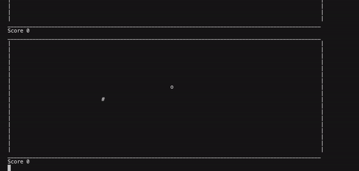

# snake-game
Replicating the snake game in Python. (Python is a snake lol)
# snake game demo

# How to play
- The snake will start moving
- Press control + c to turn. The computer will decide which way to turn based on the position of the obstacle.
- when you eat the obstacle (run over it), your score will increase and a new obstacle will appear.
- every time you eat an obstacle, the length of your snake will increase. (animation for long snake is still spotty)
- when you hit the walls, you lose.
- when you crash into yourself, you should lose (but that doesn't work yet)
# What is done so far
- snake moving
- turning and smart-turn technology(decides which way you should turn)
- relocating of obstacle when eaten
- detecting crashing into wall
- increasing length of snake
- scoring
# What is to be done
- make long snake animation better
- make it detect crashing into self
- scoreboard and storing in text file
